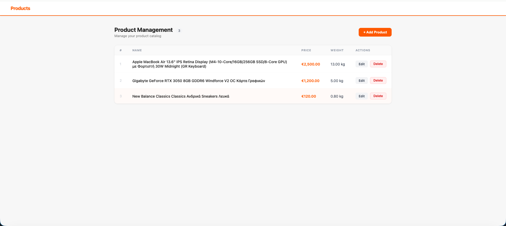
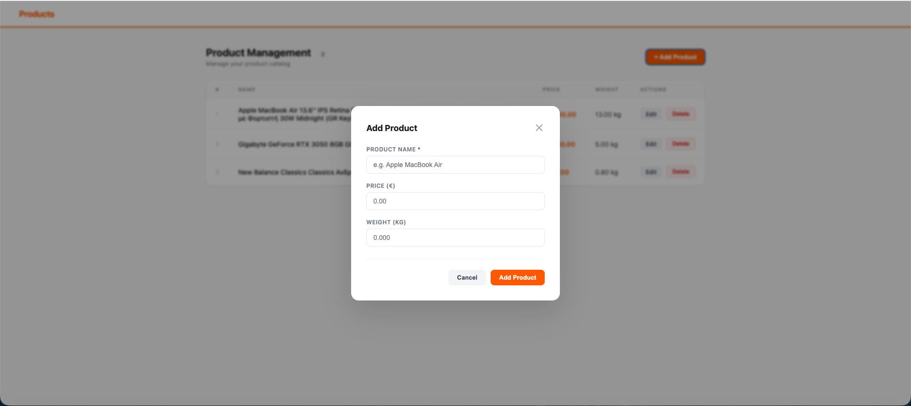
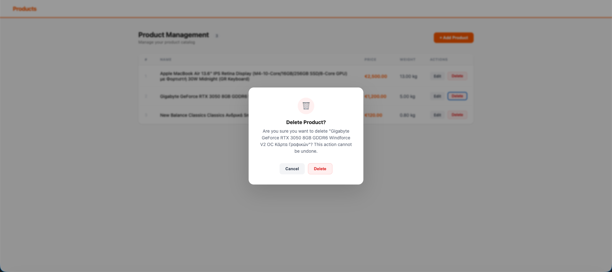

# Products CRUD — PHP & PostgreSQL

A product management web application with full CRUD functionality,
built with OOP PHP, PDO, and PostgreSQL.

## Live Demo
🔗 [View Live App](https://products-crud-php.onrender.com)

## Screenshots





## Features
- Product listing with clean, responsive table
- Add product via modal form
- Edit product on dedicated page
- Delete product with confirmation dialog
- PRG pattern — prevents duplicate submissions on refresh
- Server-side & client-side validation
- Security — PDO prepared statements prevent SQL injection

## Tech Stack
- PHP 8.2 (OOP, PDO)
- PostgreSQL 18
- HTML5 / CSS3 / Vanilla JS
- Docker
- Deployed on Render

## Local Development
Requires PHP 8.x and PostgreSQL

1. Clone the repo
2. Create database: `CREATE DATABASE products_db;`
3. Run the table migration:
```sql
CREATE TABLE products (
    id SERIAL PRIMARY KEY,
    name VARCHAR(255) NOT NULL,
    price DECIMAL(10, 2) NOT NULL DEFAULT 0.00,
    weight DECIMAL(10, 2) NOT NULL DEFAULT 0.000,
    created_at TIMESTAMP DEFAULT CURRENT_TIMESTAMP,
    updated_at TIMESTAMP DEFAULT CURRENT_TIMESTAMP
);
```
4. Update `config/db.php` with your local credentials
5. Run: `php -S localhost:8000`
6. Open: `http://localhost:8000/products.php`